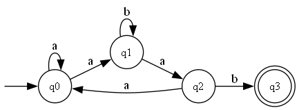
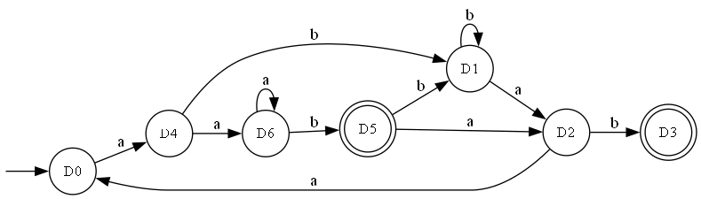

# Determinism in Finite Automata. Conversion from NDFA to DFA. Chomsky Hierarchy.

### Course: Formal Languages & Finite Automata

### Author: Student — Variant 17

---

## Theory

A **finite automaton (FA)** is a mathematical model of computation consisting of a finite set of states, an input alphabet, a transition function, an initial state, and a set of accepting (final) states. It processes an input string symbol by symbol, transitioning between states according to its transition function.

A finite automaton is **deterministic (DFA)** if, for every state and every input symbol, there is exactly one transition — meaning the next state is always uniquely determined. Conversely, a **non-deterministic finite automaton (NDFA/NFA)** allows multiple transitions from a single state on the same input symbol, or may have transitions on no input at all (ε-transitions). While NFAs are conceptually simpler to design for many problems, every NFA can be converted to an equivalent DFA using the **subset construction** (power-set) algorithm.

The **Chomsky hierarchy** classifies formal grammars into four types:

- **Type 0 (Unrestricted):** No restrictions on production rules.
- **Type 1 (Context-Sensitive):** Every production satisfies |α| ≤ |β| (with the possible exception S → ε).
- **Type 2 (Context-Free):** Every left-hand side is a single non-terminal.
- **Type 3 (Regular):** Productions are of the form A → aB or A → a (right-linear), or equivalently A → Ba or A → a (left-linear). Regular grammars generate exactly the class of regular languages, which are also recognized by finite automata.

## Objectives

1. Understand what an automaton is and what it can be used for.
2. Provide a function that classifies a grammar based on the Chomsky hierarchy.
3. For the given finite automaton (Variant 17):
   - a. Implement conversion of a finite automaton to a regular grammar.
   - b. Determine whether the FA is deterministic or non-deterministic.
   - c. Implement conversion from NDFA to DFA.
   - d. (Bonus) Represent the finite automaton graphically.

## Variant 17 — Input Definition

The finite automaton for Variant 17 is defined as:

```
Q  = {q0, q1, q2, q3}
Σ  = {a, b, c}
F  = {q3}
δ(q0, a) = q0
δ(q0, a) = q1
δ(q1, b) = q1
δ(q1, a) = q2
δ(q2, b) = q3
δ(q2, a) = q0
```

Note that `δ(q0, a)` maps to both `q0` and `q1`, which is the source of non-determinism. Internally, this is represented as `δ(q0, a) = {q0, q1}`.

## Implementation Description

The project is implemented in Python 3 and consists of three files:

- `grammar.py` — The `Grammar` class with Chomsky hierarchy classification.
- `finite_automaton.py` — The `FiniteAutomaton` class with FA operations.
- `main.py` — Demonstration and testing of all features.

### 1. Grammar Class and Chomsky Hierarchy Classification (Task 2a)

The `Grammar` class represents a formal grammar `G = (VN, VT, P, S)` and provides a method `classify_chomsky()` that returns the grammar type (0–3). The classification works by checking conditions from the most restrictive type (Type 3) to the least restrictive (Type 0):

```python
def classify_chomsky(self):
    if self._is_regular():
        return (3, "Type 3 - Regular Grammar")
    elif self._is_context_free():
        return (2, "Type 2 - Context-Free Grammar")
    elif self._is_context_sensitive():
        return (1, "Type 1 - Context-Sensitive Grammar")
    else:
        return (0, "Type 0 - Unrestricted Grammar")
```

For the **regular grammar check**, the method verifies that every production has a single non-terminal on the left side, and the right side is either a string of terminals, or a string of terminals followed by a single non-terminal (right-linear), or vice versa (left-linear). It also ensures consistency — mixing right-linear and left-linear forms is not allowed:

```python
def _is_regular(self):
    right_linear = True
    left_linear = True
    for lhs, rhs_list in self.P.items():
        if lhs not in self.VN:
            return False
        for rhs in rhs_list:
            if rhs in ('ε', ''):
                continue
            symbols = list(rhs)
            non_terminals = [s for s in symbols if s in self.VN]
            if len(non_terminals) > 1:
                return False
            if len(non_terminals) == 1:
                nt_pos = next(i for i, s in enumerate(symbols) if s in self.VN)
                if nt_pos == len(symbols) - 1:
                    left_linear = False
                elif nt_pos == 0:
                    right_linear = False
                else:
                    return False
    return right_linear or left_linear
```

### 2. Determinism Check (Task 3b)

A finite automaton is deterministic if and only if for every `(state, symbol)` pair there is **at most one** next state. The `is_deterministic()` method iterates over all state–symbol pairs and checks whether the transition set has more than one element:

```python
def is_deterministic(self):
    for state in self.Q:
        for symbol in self.sigma:
            next_states = self.delta.get((state, symbol), set())
            if len(next_states) > 1:
                return False, (
                    f"δ({state}, {symbol}) = {{{', '.join(sorted(next_states))}}} "
                    f"— multiple transitions"
                )
    return True, "Each (state, symbol) pair has at most one transition."
```

For Variant 17, the method correctly identifies `δ(q0, a) = {q0, q1}` as the source of non-determinism.

### 3. FA to Regular Grammar Conversion (Task 3a)

The conversion from a finite automaton to a right-linear regular grammar follows these rules:

1. Map each state to a non-terminal symbol (q0 → S, q1 → A, q2 → B, …).
2. For each transition `δ(qi, a) = qj`:
   - If `qj` is **not final**: add production `Qi → aQj`.
   - If `qj` **is final** with outgoing transitions: add `Qi → a` and `Qi → aQj`.
   - If `qj` **is final** with no outgoing transitions: add only `Qi → a`.

```python
for (state, symbol), next_states in self.delta.items():
    for ns in next_states:
        nt_from = state_to_nt[state]
        nt_to = state_to_nt[ns]
        has_outgoing = any(
            len(self.delta.get((ns, s), set())) > 0 for s in self.sigma
        )
        if ns in self.F:
            P[nt_from].append(symbol)
            if has_outgoing:
                P[nt_from].append(symbol + nt_to)
        else:
            P[nt_from].append(symbol + nt_to)
```

The resulting grammar for Variant 17 is:

```
VN = {S, A, B}     VT = {a, b, c}     Start = S

S → aS | aA
A → bA | aB
B → b  | aS
```

This is classified as **Type 3 — Regular Grammar** (right-linear form).

### 4. NDFA to DFA Conversion — Subset Construction (Task 3c)

The subset construction algorithm converts an NFA to an equivalent DFA where each DFA state corresponds to a **set** of NFA states. The algorithm works as follows:

1. The start state of the DFA is `{q0}`.
2. For each unprocessed DFA state and each input symbol, compute the union of all NFA states reachable from any state in the set.
3. The resulting set becomes a new DFA state. Repeat until no new states are discovered.
4. A DFA state is final if it contains any NFA final state.

```python
def to_dfa(self):
    start = frozenset([self.q0])
    dfa_states = set()
    dfa_delta = {}
    worklist = [start]
    while worklist:
        current = worklist.pop(0)
        if current in dfa_states:
            continue
        dfa_states.add(current)
        for symbol in sorted(self.sigma):
            next_set = set()
            for state in current:
                next_set |= self.delta.get((state, symbol), set())
            if not next_set:
                continue
            next_frozen = frozenset(next_set)
            dfa_delta[(current, symbol)] = {next_frozen}
            if next_frozen not in dfa_states:
                worklist.append(next_frozen)
    ...
```

#### Step-by-step conversion for Variant 17:

| DFA State | NFA States   | on `a` | on `b` | on `c` | Final?  |
| --------- | ------------ | ------ | ------ | ------ | ------- |
| D0        | {q0}         | D4     | —      | —      | No      |
| D1        | {q1}         | D2     | D1     | —      | No      |
| D2        | {q2}         | D0     | D3     | —      | No      |
| D3        | {q3}         | —      | —      | —      | **Yes** |
| D4        | {q0, q1}     | D6     | D1     | —      | No      |
| D5        | {q1, q3}     | D2     | D1     | —      | **Yes** |
| D6        | {q0, q1, q2} | D6     | D5     | —      | No      |

The resulting DFA has **7 states** and **2 final states** (D3 and D5). It is verified to be deterministic — every `(state, symbol)` pair has at most one transition.

### 5. Graphical Representation (Task 3d — Bonus)

The `draw_graph()` method uses the `graphviz` Python library to render the automaton as a directed graph. States are circles (double circles for final states), transitions are labeled edges, and an invisible node creates the start arrow:

```python
def draw_graph(self, filename='fa_graph', title='Finite Automaton'):
    from graphviz import Digraph
    dot = Digraph(comment=title)
    dot.attr(rankdir='LR', size='10')
    dot.node('__start__', '', shape='none', width='0', height='0')
    for state in sorted(self.Q):
        if state in self.F:
            dot.node(state, state, shape='doublecircle')
        else:
            dot.node(state, state)
    dot.edge('__start__', self.q0)
    # Combine labels for edges between the same pair of states
    edge_labels = {}
    for (src, symbol), dst_set in self.delta.items():
        for dst in dst_set:
            edge_labels.setdefault((src, dst), []).append(symbol)
    for (src, dst), symbols in sorted(edge_labels.items()):
        dot.edge(src, dst, label=', '.join(sorted(symbols)))
    dot.render(filename, format='png', cleanup=True)
```

## Conclusions / Screenshots / Results

### Results

All tasks were successfully implemented and verified:

**Determinism check (Task 3b):** The FA for Variant 17 is correctly identified as **non-deterministic** because `δ(q0, a) = {q0, q1}` — there are two possible transitions from state `q0` on input `a`.

**FA → Grammar conversion (Task 3a):** The FA is converted to the right-linear regular grammar:

```
S → aS | aA
A → bA | aB
B → b  | aS
```

**Chomsky classification (Task 2a):** The derived grammar is classified as **Type 3 — Regular Grammar**. The classifier was verified with additional examples of Type 2 (Context-Free) and Type 1 (Context-Sensitive) grammars.

**NDFA → DFA conversion (Task 3c):** The subset construction produces a DFA with 7 states (D0–D6), 2 final states (D3, D5). The DFA is verified to be deterministic, and string acceptance tests confirm that the NFA and DFA accept/reject the same strings:

```
String                  NFA        DFA    Match
---------------- ---------- ---------- --------
'aab'                Accept     Accept       OK
'abab'               Accept     Accept       OK
'abbab'              Accept     Accept       OK
'aaab'               Accept     Accept       OK
'aabaaaab'           Accept     Accept       OK
'ab'                 Reject     Reject       OK
'b'                  Reject     Reject       OK
'a'                  Reject     Reject       OK
'ba'                 Reject     Reject       OK
'aabb'               Reject     Reject       OK
```

**Graphical representation (Task 3d — Bonus):** Both the NDFA and DFA are rendered as PNG images using Graphviz.

NDFA (Variant 17):



DFA (Variant 17):



## References

1. Hopcroft, J. E., Motwani, R., & Ullman, J. D. (2006). _Introduction to Automata Theory, Languages, and Computation_. Pearson.
2. Sipser, M. (2012). _Introduction to the Theory of Computation_. Cengage Learning.
3. Chomsky, N. (1956). _Three models for the description of language_. IRE Transactions on Information Theory, 2(3), 113–124.
4. Graphviz — Graph Visualization Software: https://graphviz.org/
